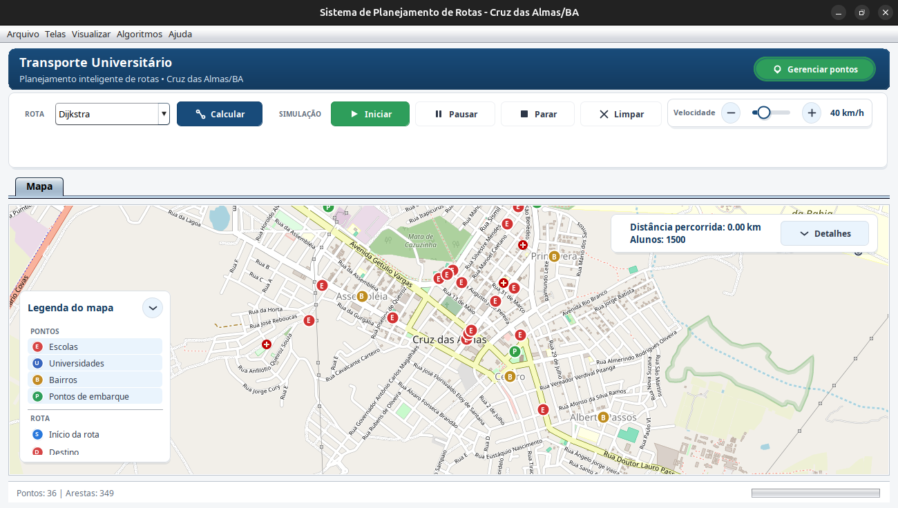
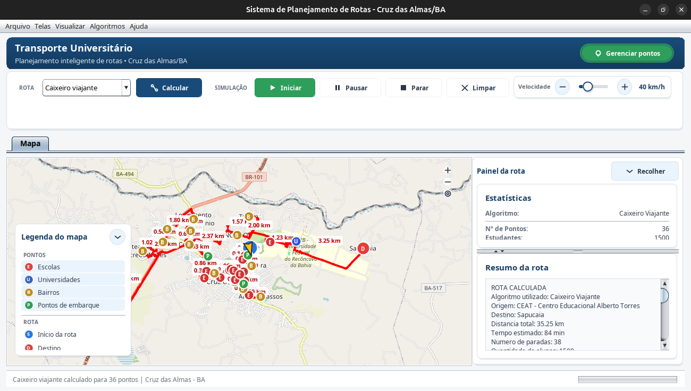

# Sistema de Planejamento de Rotas — Cruz das Almas/BA

Aplicação desktop desenvolvida em Java Swing como Trabalho Final da disciplina de Estrutura de Dados. O sistema representa pontos de Cruz das Almas/BA como um grafo, executa algoritmos clássicos, desenha as rotas no mapa e simula o deslocamento de um veículo.

O projeto utiliza apenas o JDK e bibliotecas JAR armazenadas em `lib/`. Não depende de Maven, Gradle ou Node.js.

## Interface



### Rota calculada e painel de informações



A interface possui mapa interativo, legenda, gerenciamento de pontos, seleção de algoritmo, controles de simulação, ajuste de velocidade e um painel lateral redimensionável com estatísticas e resumo da rota.

Consulte [todas as telas e o quadro comparativo dos algoritmos](docs/telas-e-comparativo-algoritmos.md).

## Base padrão

| Informação | Quantidade |
|---|---:|
| Pontos cadastrados | 36 |
| Escolas | 18 |
| Universidades | 1 |
| Bairros | 14 |
| Pontos de embarque | 3 |
| Arestas | 349 |
| Alunos | 1500 |

As coordenadas usam o sistema WGS84. A aplicação inicia centralizada em Cruz das Almas, nas coordenadas aproximadas `-12.6723, -39.1054`.

## Funcionalidades

- visualização do OpenStreetMap com zoom e movimentação;
- marcadores distintos para escolas, universidade, bairros e pontos de embarque;
- legenda interativa com filtros por tipo de ponto;
- cadastro, pesquisa, edição e remoção de pontos;
- seleção de todos os pontos ou de um subconjunto para o cálculo;
- seleção de origem, destino e ponto inicial;
- desenho da rota com distâncias entre paradas;
- enquadramento automático do percurso;
- estatísticas de distância, tempo, alunos, paradas e combustível;
- resumo textual com a ordem de visita;
- painel lateral ajustável com `JSplitPane`;
- animação do veículo com velocidade configurável, pausa e reinício;
- abertura e salvamento de projetos;
- exportação em CSV, TXT e PDF;
- funcionamento local quando o serviço de rotas viárias estiver indisponível.

## Algoritmos

| Algoritmo | Finalidade |
|---|---|
| Dijkstra | Menor caminho entre uma origem e um destino |
| Prim | Árvore geradora mínima a partir de um ponto inicial |
| Kruskal | Árvore geradora mínima pela ordenação global das arestas |
| BFS | Percurso do grafo em largura |
| DFS | Percurso do grafo em profundidade |
| Guloso | Rota aproximada considerando distância, prioridade e demanda |
| TSP simplificado | Heurística para ordenar a visita de várias paradas |

A classe `VRP` também está disponível na camada de algoritmos para distribuição entre múltiplos veículos, mas não aparece na toolbar principal atual.

Para manter o desenho e a animação contínuos, mudanças entre vértices não adjacentes são expandidas para caminhos existentes no grafo.

## Mapas e rotas viárias

O mapa é fornecido pelo OpenStreetMap por meio do JXMapViewer2. Após o cálculo, o sistema tenta obter no OSRM:

- geometria pelas ruas;
- distância de cada trecho;
- distância total;
- duração estimada.

Se o OSRM estiver indisponível, a aplicação mantém a rota com geometria local e distâncias calculadas pela fórmula de Haversine. Os algoritmos continuam funcionando sem internet, mas o fundo cartográfico depende dos tiles do OpenStreetMap.

## Animação

A rota desenhada e a animação utilizam a mesma sequência de coordenadas. Um `javax.swing.Timer` atualiza o veículo aproximadamente a cada 16 ms. A posição considera o tempo transcorrido e a velocidade selecionada, enquanto a orientação é calculada pela direção do segmento atual.

## Tecnologias

- Java 21;
- Java Swing;
- JXMapViewer2 2.8;
- OpenStreetMap;
- OSRM;
- arquivos CSV para os dados iniciais;
- Nimbus Look and Feel com componentes visuais próprios.

## Requisitos

- JDK 21 ou superior;
- ambiente gráfico para abrir o Swing;
- internet para carregar o mapa e consultar o OSRM;
- Visual Studio Code e **Extension Pack for Java**, opcionalmente.

Verifique o Java:

```bash
java -version
javac -version
```

## Estrutura do projeto

```text
.
├── src/
│   ├── Main.java
│   ├── algoritmos/          # Dijkstra, Prim, Kruskal, BFS, DFS, Guloso, TSP e VRP
│   ├── gui/                 # Janelas, controladores visuais, mapa e animação
│   │   └── components/      # Componentes Swing reutilizáveis
│   ├── model/               # Grafo, pontos, arestas, rotas e veículos
│   ├── services/            # Dados, projetos, simulação e integração OSRM
│   └── util/                # Geometria, distâncias e exportadores
├── dados/
│   ├── vertices.csv
│   └── edges.csv
├── lib/
│   ├── jxmapviewer2-2.8.jar
│   └── commons-logging-1.3.0.jar
├── tests/
│   ├── RouteSmokeTest.java
│   └── OsrmIntegrationTest.java
├── docs/
│   ├── telas-e-comparativo-algoritmos.md
│   └── prints/              # 19 capturas reais da aplicação
├── .vscode/                 # Build, execução e configuração do Java
└── README.md
```

## Executar pelo VS Code

1. Abra a pasta raiz do projeto.
2. Execute `Ctrl+Shift+B` para compilar em `bin/`.
3. Abra `src/Main.java`.
4. Pressione `F5` e escolha **Executar Main**.

As configurações estão em `.vscode/tasks.json` e `.vscode/launch.json`.

## Executar pelo terminal

### Linux

```bash
mkdir -p bin
javac --release 21 -encoding UTF-8 -cp "lib/*" -d bin $(find src -name "*.java")
java -cp "bin:lib/*" Main
```

### Windows PowerShell

```powershell
$sources = Get-ChildItem -Path src -Recurse -Filter *.java | ForEach-Object FullName
New-Item -ItemType Directory -Force -Path bin | Out-Null
javac --release 21 -encoding UTF-8 -cp "lib/*" -d bin $sources
java -cp "bin;lib/*" Main
```

## Testes

### Linux

```bash
javac --release 21 -encoding UTF-8 -cp "bin:lib/*" -d bin $(find tests -name "*.java")
java -ea -cp "bin:lib/*" RouteSmokeTest
java -ea -cp "bin:lib/*" OsrmIntegrationTest
```

### Windows PowerShell

```powershell
$tests = Get-ChildItem -Path tests -Filter *.java | ForEach-Object FullName
javac --release 21 -encoding UTF-8 -cp "bin;lib/*" -d bin $tests
java -ea -cp "bin;lib/*" RouteSmokeTest
java -ea -cp "bin;lib/*" OsrmIntegrationTest
```

- `RouteSmokeTest` valida dados padrão, coordenadas, conectividade, algoritmos e continuidade das rotas.
- `OsrmIntegrationTest` valida uma resposta real do OSRM e necessita de internet.

## Uso básico

1. Inicie a aplicação.
2. Selecione um algoritmo na barra superior.
3. Clique em **Calcular**.
4. Escolha os pontos e o ponto inicial quando solicitado.
5. Consulte a rota, as estatísticas e o resumo no painel lateral.
6. Ajuste a velocidade.
7. Use **Iniciar**, **Pausar**, **Parar** ou **Limpar**.

## Legenda dos marcadores

| Marcador | Significado |
|:---:|---|
| E | Escola |
| U | Universidade |
| B | Bairro |
| P | Ponto de embarque |
| S | Início da rota |
| D | Destino |

## Documentação e prints

- [Telas e comparativo dos algoritmos](docs/telas-e-comparativo-algoritmos.md);
- [pasta com os 19 prints da interface](docs/prints/).

O relatório contém capturas da tela principal, gerenciamento e formulário de pontos, seleções de rota, exportação, resumo ampliado, simulação e resultado visual de cada algoritmo.

## Solução de problemas

### `package org.jxmapviewer... does not exist`

Confirme a existência de:

```text
lib/jxmapviewer2-2.8.jar
lib/commons-logging-1.3.0.jar
```

No VS Code, execute:

1. `Java: Clean Java Language Server Workspace`;
2. **Restart and delete**;
3. aguarde a reimportação do projeto.

### O mapa não aparece

Verifique a conexão com a internet. Os cálculos continuam funcionando, mas os tiles do OpenStreetMap não são exibidos offline.

### A rota usa aproximação local

O OSRM não respondeu dentro do tempo configurado. Verifique a conexão e calcule novamente. A rota local continua válida para visualização e simulação.

### Caracteres acentuados incorretos

Compile com `-encoding UTF-8`, conforme os comandos deste README.

## Dependências locais

| Biblioteca | Finalidade |
|---|---|
| `jxmapviewer2-2.8.jar` | Exibição e navegação do mapa |
| `commons-logging-1.3.0.jar` | Logging utilizado pelo visualizador |

As dependências são carregadas localmente a partir de `lib/`.
