# Telas do Sistema e Quadro Comparativo dos Algoritmos

Este documento registra a interface atual do Sistema de Planejamento de Rotas e compara os sete algoritmos implementados. As telas foram capturadas diretamente da aplicação Java Swing em **17 de julho de 2026**.

## Metodologia da execução

Para garantir uma comparação justa, todos os algoritmos foram executados com a mesma base:

- **36 pontos** cadastrados;
- **349 arestas** no grafo não direcionado;
- **1500 alunos** distribuídos entre os pontos;
- origem comum: **CEAT - Centro Educacional Alberto Torres**;
- destino do Dijkstra: **Portaria UFRB**;
- velocidade inicial da simulação: **40 km/h**;
- todos os pontos foram selecionados nos algoritmos de múltiplas paradas;
- cálculo iniciado pelos controles normais da interface, respondendo aos mesmos diálogos apresentados ao usuário;
- geometria, distância e duração obtidas pelo **OSRM**, com o mapa carregado pelo OpenStreetMap.

Cada captura foi realizada somente depois da conclusão indicada pela barra de status. As distâncias representam a rota viária efetivamente percorrida e exibida pela interface. Em Prim e Kruskal, o percurso retorna pelos ramos da árvore para permanecer contínuo; por isso, a distância de viagem é maior que o peso estrutural da árvore geradora mínima.

## Telas da aplicação

### 1. Mapa principal

Apresenta o mapa de Cruz das Almas, pontos cadastrados, legenda interativa, seleção de algoritmo, comandos de simulação e controle de velocidade.

### 2. Painel lateral da rota

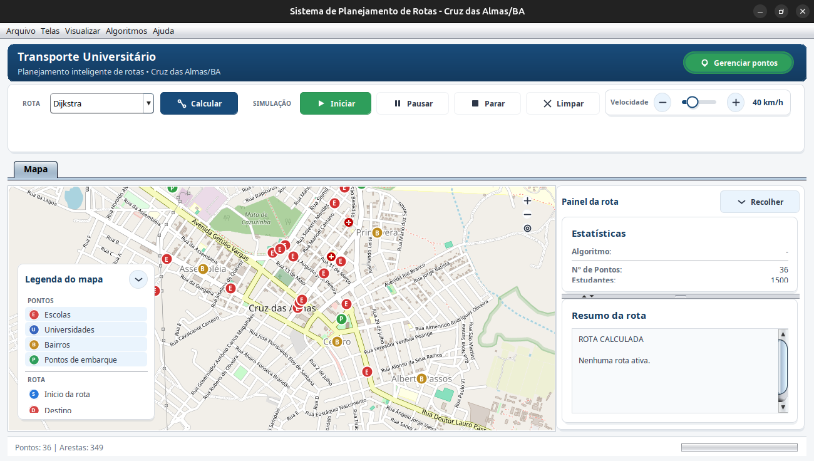

O painel lateral reúne estatísticas e resumo textual. O `JSplitPane` permite redimensionar as duas áreas arrastando o divisor.

### 3. Gerenciamento de pontos

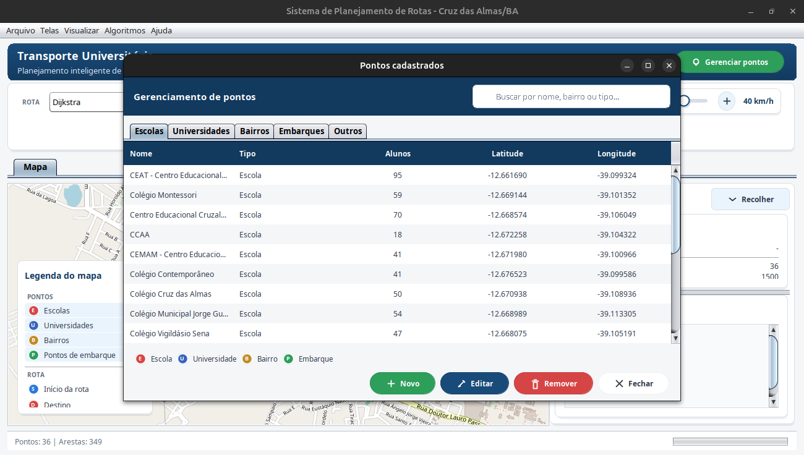

Permite pesquisar, ordenar, cadastrar, editar e remover escolas, universidades, bairros, pontos de embarque e outros pontos.

### 4. Cadastro de ponto

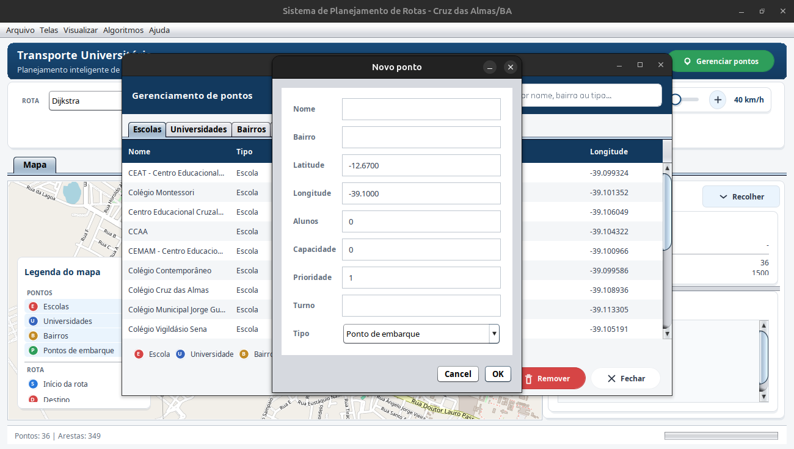

Formulário utilizado para informar nome, bairro, coordenadas, alunos, capacidade, prioridade, turno e tipo.

### 5. Edição de ponto

Utiliza o mesmo componente de formulário, preenchido com os dados atuais do ponto selecionado.

### 6. Seleção de origem ou destino

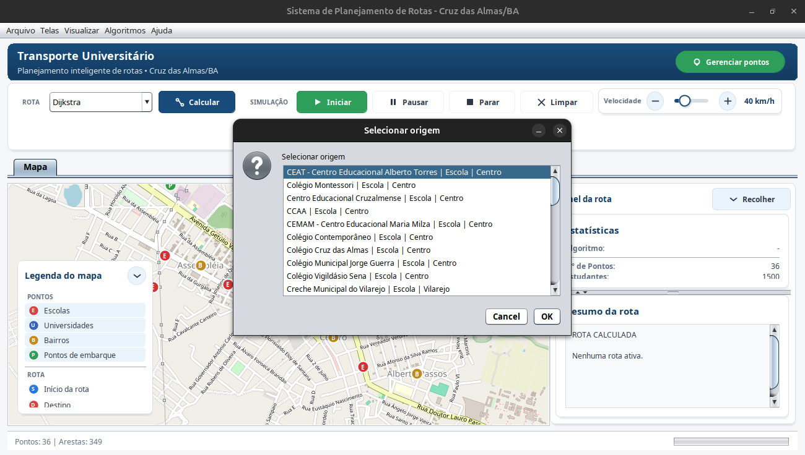

Usada pelo Dijkstra para origem e destino e pelos demais algoritmos para definir o ponto inicial.

### 7. Opção de abrangência dos pontos

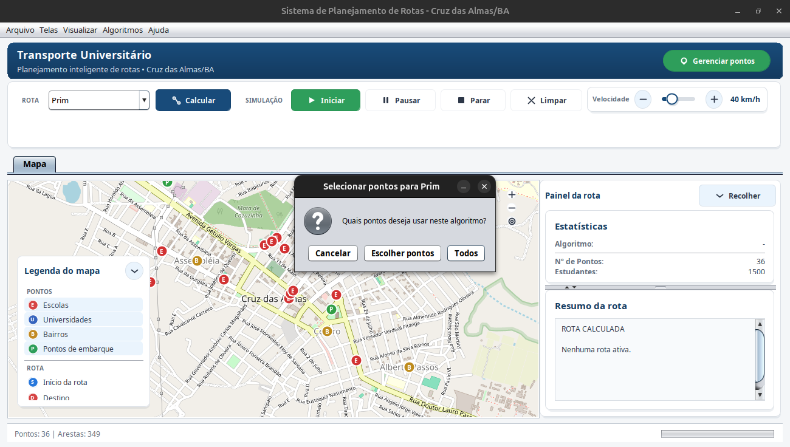

Permite executar o algoritmo com todos os pontos ou escolher manualmente um subconjunto.

### 8. Seleção múltipla de pontos

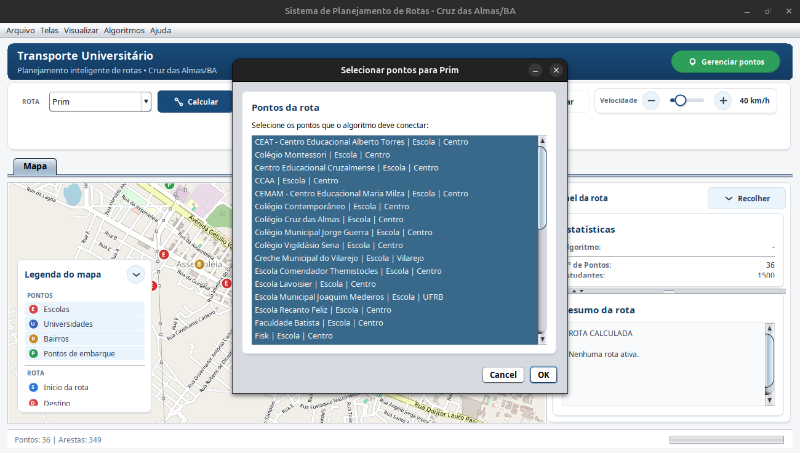

Lista utilizada para selecionar os vértices que participarão do cálculo.

### 9. Persistência e exportação

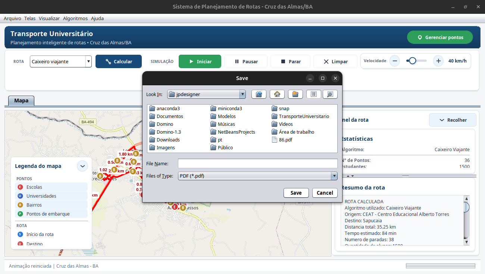

Janela usada nos fluxos de salvar projeto e exportar resultados em PDF, CSV ou TXT.

### 10. Informações do sistema

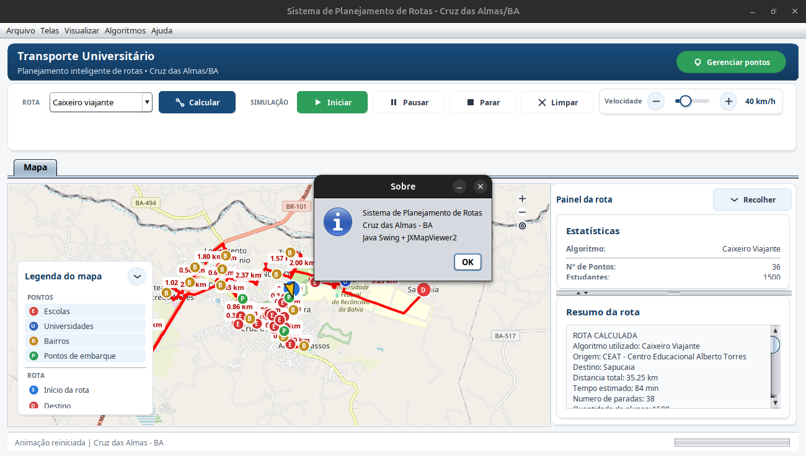

Diálogo com a identificação da aplicação e das tecnologias principais.

### 11. Resumo da rota ampliado

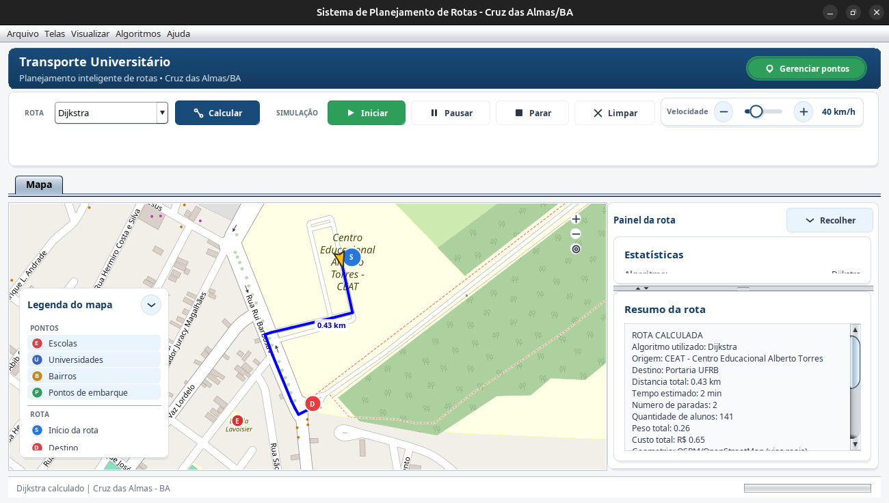

O duplo clique no divisor amplia o resumo; outro duplo clique restaura a divisão anterior. O divisor também pode ser arrastado livremente.

### 12. Simulação do veículo

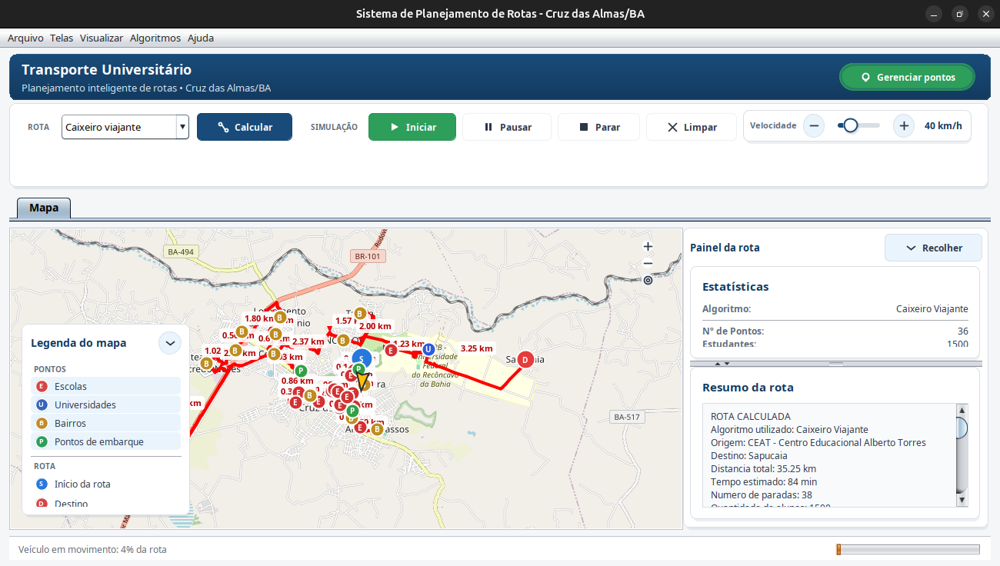

Exibe o veículo em movimento, percentual percorrido, barra de progresso e rota calculada.

## Resultado visual de cada algoritmo

### Dijkstra

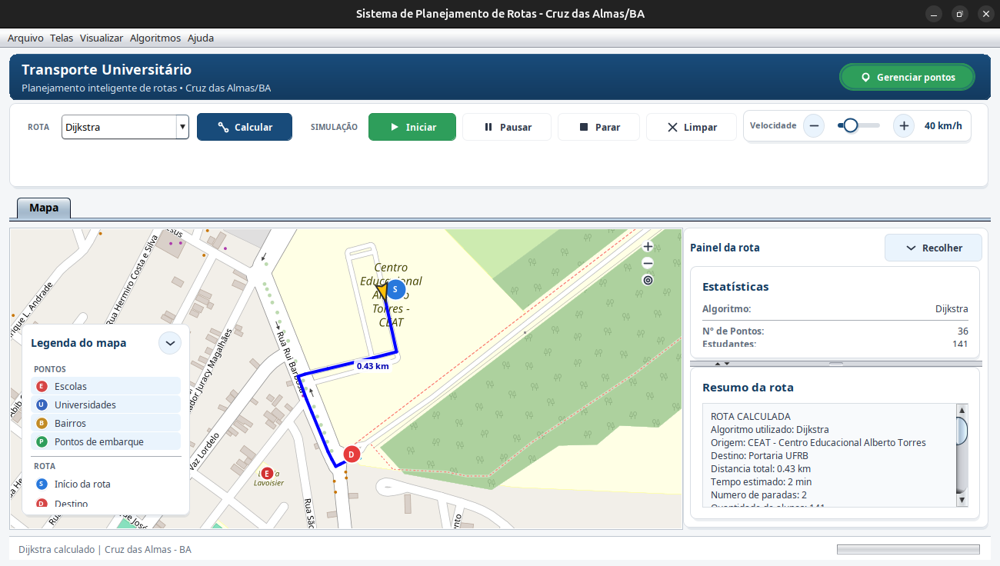

Calcula o menor caminho entre a origem e o destino selecionados.

### Prim

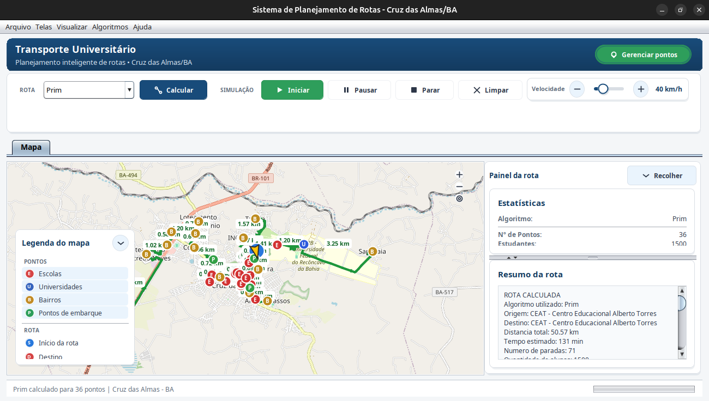

Constrói uma árvore geradora mínima a partir do ponto inicial e transforma a árvore em um passeio contínuo para visualização e simulação.

### Kruskal

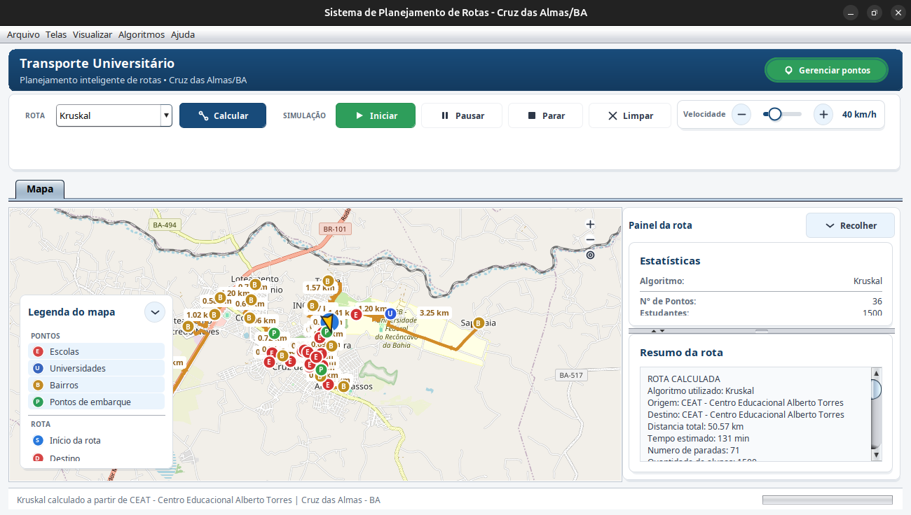

Seleciona arestas de menor peso sem formar ciclos e produz uma árvore geradora mínima.

### BFS

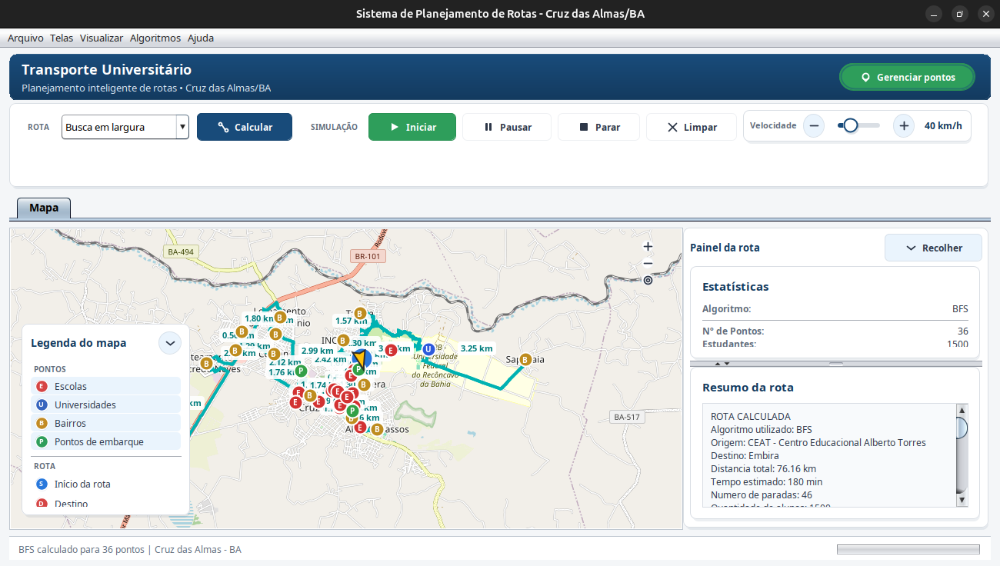

Percorre o grafo em largura, visitando primeiro os pontos dos níveis mais próximos.

### DFS

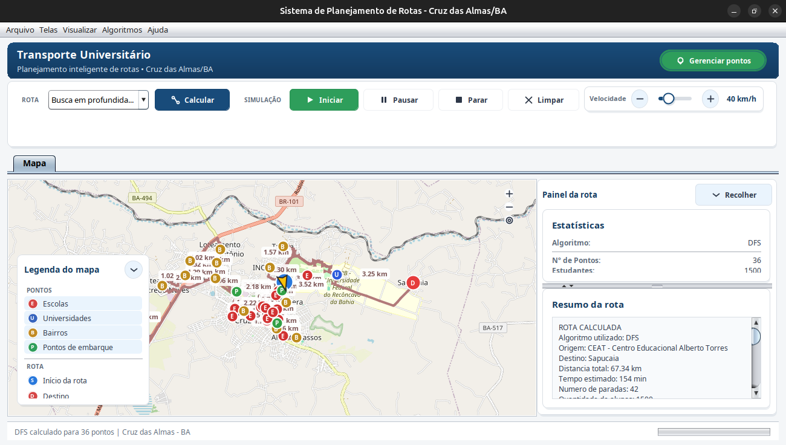

Percorre o grafo em profundidade antes de retornar para explorar outros ramos.

### Guloso

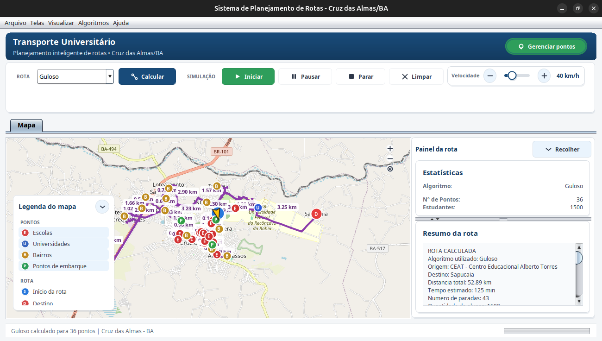

Produz rapidamente uma rota aproximada considerando distância, prioridade e demanda de alunos.

### TSP simplificado

Usa uma heurística para encontrar uma ordem curta de visita aos pontos, sem executar a busca exata de todas as permutações.

## Quadro comparativo conceitual

| Algoritmo | Classe do problema | Considera pesos | Resultado | Garante ótimo? | Uso recomendado no sistema |
|---|---|:---:|---|---|---|
| Dijkstra | Menor caminho | Sim | Caminho entre dois pontos | Sim, com pesos não negativos | Deslocamento específico entre origem e destino |
| Prim | Árvore geradora mínima | Sim | Árvore conectando todos os pontos | Sim para o peso da árvore | Planejar uma rede de conexão iniciada em um ponto |
| Kruskal | Árvore geradora mínima | Sim | Árvore conectando todos os pontos | Sim para o peso da árvore | Planejar uma rede pelo conjunto global de arestas |
| BFS | Percurso em largura | Não na ordem de visita | Ordem por níveis | Não para distância ponderada | Analisar conectividade e vizinhanças |
| DFS | Percurso em profundidade | Não na ordem de visita | Ordem por aprofundamento | Não para distância ponderada | Explorar ramos e componentes do grafo |
| Guloso | Roteamento heurístico | Sim | Sequência aproximada | Não | Obter rapidamente uma rota orientada por demanda |
| TSP simplificado | Ordenação heurística de visitas | Sim | Sequência aproximada de paradas | Não | Reduzir o deslocamento ao visitar muitos pontos |

## Resultados medidos no grafo padrão

| Algoritmo | Distância | Tempo | Passagens na rota | Pontos únicos | Arestas do resultado | Alunos | Ponto final |
|---|---:|---:|---:|---:|---:|---:|---|
| Dijkstra | **0,43 km** | 2 min | 2 | 2 | 1 | 141 | Portaria UFRB |
| Prim | **50,57 km** | 131 min | 71 | 36 | 35 | 1500 | CEAT (retorno) |
| Kruskal | **50,57 km** | 131 min | 71 | 36 | 35 | 1500 | CEAT (retorno) |
| BFS | **76,16 km** | 180 min | 46 | 36 | 45 | 1500 | Embira |
| DFS | **67,34 km** | 154 min | 42 | 36 | 41 | 1500 | Sapucaia |
| Guloso | **52,89 km** | 125 min | 43 | 36 | 42 | 1500 | Sapucaia |
| TSP simplificado | **35,25 km** | 84 min | 38 | 36 | 37 | 1500 | Sapucaia |

### Interpretação dos resultados

- O **Dijkstra** tem a menor distância porque resolve apenas o trajeto entre dois pontos, enquanto os demais atendem toda a seleção.
- **Prim** e **Kruskal** produziram árvores com 35 arestas e peso estrutural aproximado de **16,81 km**. A viagem viária contínua mede **50,57 km** porque precisa retornar pelos ramos da árvore e seguir as ruas disponíveis.
- Entre os percursos que atendem os 36 pontos, o **TSP simplificado** apresentou a menor distância: **35,25 km**.
- O **Guloso** percorreu **52,89 km**, privilegiando rapidez de decisão e demanda em vez de garantir o menor resultado global.
- **BFS** apresentou a maior distância porque sua prioridade é a visita por níveis, não a minimização do custo total.
- **DFS** foi menor que BFS nesta base, mas sua ordem continua dependente da estrutura e da ordem das adjacências.

## Ranking das rotas com todos os pontos

| Posição | Algoritmo | Distância | Diferença para o TSP |
|---:|---|---:|---:|
| 1 | TSP simplificado | 35,25 km | 0,00 km |
| 2 | Prim | 50,57 km | +15,32 km |
| 2 | Kruskal | 50,57 km | +15,32 km |
| 4 | Guloso | 52,89 km | +17,64 km |
| 5 | DFS | 67,34 km | +32,09 km |
| 6 | BFS | 76,16 km | +40,91 km |

Prim e Kruskal aparecem no ranking pela distância do passeio contínuo exibido no mapa. Seu objetivo matemático, entretanto, é minimizar o peso da árvore, e não encontrar a menor sequência de visita.

## Conclusão

Não existe um único algoritmo melhor para todas as situações. Dijkstra é adequado para dois pontos; Prim e Kruskal são apropriados para estruturar uma rede mínima; BFS e DFS demonstram estratégias de exploração; Guloso oferece uma solução rápida orientada por critérios práticos; e o TSP simplificado foi o mais eficiente para ordenar a visita de todos os pontos nesta execução.
